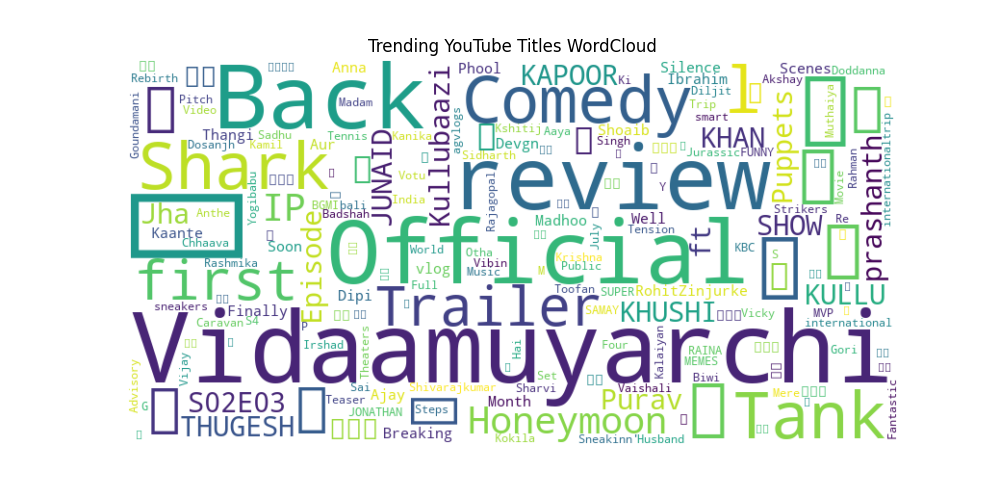

# YouTube Trend Analysis

## 📌 Project Overview
This project analyzes trending YouTube video titles to generate insights and visualize the most commonly used words using a word cloud.

## 🔍 Features
- Fetches trending YouTube videos
- Extracts and processes video titles
- Generates a word cloud from the trending titles

## 📊 Technologies Used
- Python
- Selenium (for web scraping)
- Pandas (for data processing)
- WordCloud (for visualization)
- Matplotlib (for plotting)

## 🚀 Installation & Usage
### Prerequisites
Ensure you have Python installed along with the required dependencies. Install dependencies using:
```bash
pip install selenium pandas wordcloud matplotlib webdriver-manager
```

### Running the Script
Execute the script using:
```bash
python Youtube_trend_analysis.py
```
This will fetch trending YouTube titles and generate a word cloud.

## 📷 Output
The script generates a word cloud like this:


## 📌 Contributing
Feel free to submit issues or pull requests to improve the project.

## 📜 License
This project is licensed under the MIT License.

## 🔗 Connect
- **GitHub Repository**: [Your GitHub Repo Link]
